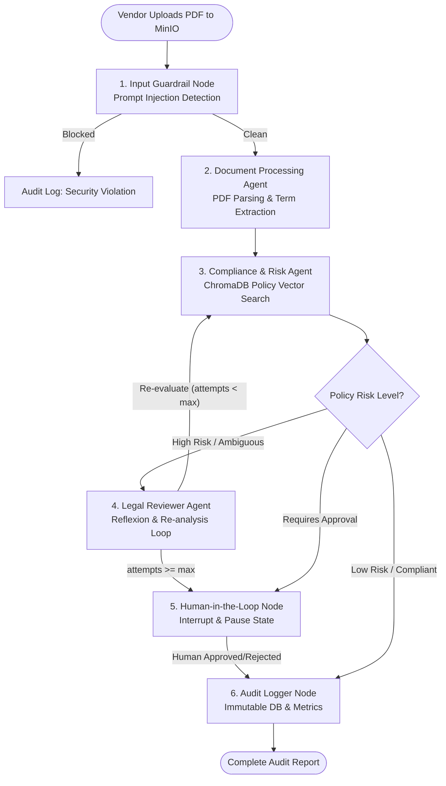

# Automated Contract Audit & Vendor Compliance Pipeline

[](https://github.com/SDAIAAcademy)
[](https://python.langchain.com/docs/langgraph/)
[](https://phoenix.arize.com/)

An enterprise-grade, multi-agent AI system that automates vendor contract auditing against corporate compliance policies. Developed as the final capstone project for the **SDAIA Academy - Advanced Agentic AI Systems Engineering** program.

---

## 🎯 Capstone Architecture & System Blueprint

The system ingests vendor contract PDFs from cloud object storage (**MinIO**), parses and structures legal clauses, evaluates compliance risks against vector-indexed corporate policies (**ChromaDB**), enforces security guardrails (prompt injection & PII masking), tracks latency and cost metrics, enables **Human-in-the-Loop (HITL)** approvals for high-risk clauses, and records an immutable audit trail in SQLite.



---

## 📋 Rubric Deliverables Mapping (100/100 Points)

| # | Capstone Deliverable | Points | Implementation in Repository |
|---|---|---|---|
| **1** | **Agentic Reasoning & Tool Use** | 15 pts | ReAct pattern, function calling, ChromaDB policy retrieval, PDF chunking, SQLite audit logging. |
| **2** | **Graph-Based Orchestration** | 20 pts | LangGraph `StateGraph` with shared `ContractAuditState`, conditional edges, and Reflexion loop with `MAX_REFLEXION_ATTEMPTS` exit cap. |
| **3** | **Multi-Agent System & Role Specialization** | 20 pts | 3 Specialized Agents: **Document Processor**, **Compliance Analyst**, and **Legal Reviewer/Critic** under a Centralized Orchestrator. |
| **4** | **Security, Guardrails & Observability** | 20 pts | Input prompt-injection detector, output PII masking (`[SSN_REDACTED]`), and structured telemetry with Arize Phoenix & LangSmith. |
| **5** | **Production Readiness: Persistence, HITL & Cloud** | 20 pts | `MemorySaver` / `SqliteSaver` checkpointer, `interrupt_before` HITL pause/resume flow, FastAPI REST API, Dockerfile & `docker-compose.yml`. |
| **6** | **Documentation & Evidence of Execution** | 5 pts | Executable Jupyter Notebook (`notebooks/capstone_demonstration.ipynb`) demonstrating all 5 happy/failure test paths with captured outputs. |

---

## 🚀 Quick Start Guide

### Prerequisites
- **Python 3.10+** (or Docker & Docker Compose)
- **Google Gemini API Key** (optional for LLM reasoning nodes; offline rule-based fallback included)

### 1. Installation & Environment Configuration
```bash
# Clone the repository
git clone https://github.com/SDAIAAcademy/contract-audit-agent.git
cd contract-audit-agent

# Install dependencies
pip install -r requirements.txt

# Configure environment variables
cp .env.example .env
```

### 2. Running via Docker Compose (Recommended Cloud Stack)
```bash
# Launch MinIO, ChromaDB, Arize Phoenix Tracing, and Agent API
docker-compose up --build
```
- **MinIO Console**: `http://localhost:9001` (User: `minioadmin`, Pass: `minioadmin`)
- **ChromaDB API**: `http://localhost:8000`
- **Arize Phoenix Tracing UI**: `http://localhost:6006`
- **Agent FastAPI Docs**: `http://localhost:8080/docs`

### 3. Running Unit & Integration Tests
```bash
pytest tests/
```

### 4. Executing Demonstration Notebook
```bash
jupyter notebook notebooks/capstone_demonstration.ipynb
```

---

## 📊 Expected Output & API Sample

### Triggering Contract Audit (`POST /upload-contract`)
```json
{
  "thread_id": "thread_9f8a2b1c",
  "contract_filename": "vendor_agreement.pdf",
  "status": "PAUSED_HITL",
  "overall_risk_level": "High",
  "is_paused_hitl": true,
  "message": "Contract audit paused at Human-in-the-Loop approval node."
}
```

### Resuming after Human Approval (`POST /approve/thread_9f8a2b1c`)
```json
{
  "thread_id": "thread_9f8a2b1c",
  "status": "COMPLETED",
  "human_approved": true,
  "message": "Graph resumed. Final status: COMPLETED"
}
```

---

## 🏫 Training Program Attribution

This project was developed under the **SDAIA Academy** training program:
- **Program**: Advanced Agentic AI Systems Engineering
- **Institution**: SDAIA Academy (Saudi Data & AI Authority)
- **Repository Link**: Reference [SDAIA Academy on GitHub](https://github.com/SDAIAAcademy)
