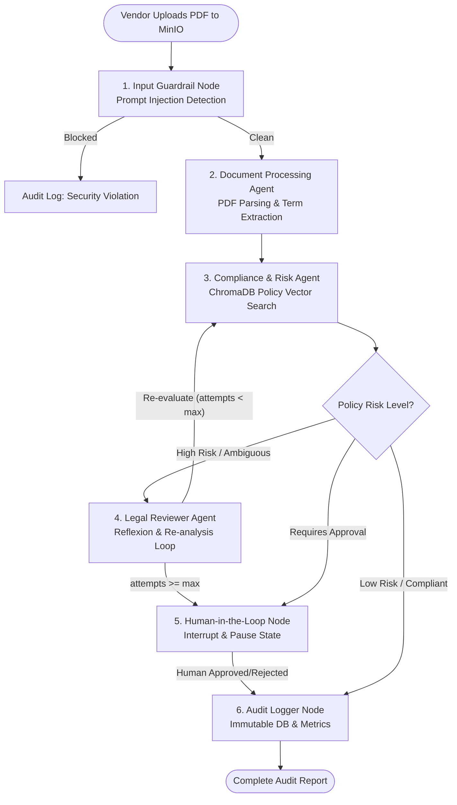

# Implementation Plan: Automated Contract Audit & Vendor Compliance Pipeline

This project builds a production-ready, multi-agent AI system for auditing vendor PDF contracts against corporate compliance policies. It is designed to satisfy 100% of the **SDAIA Academy Advanced Agentic AI Systems Engineering Capstone Rubric** (100/100 points).

---

## 🎯 Capstone Architecture & System Blueprint

The system will ingest vendor PDF contracts from a simulated cloud bucket (**MinIO**), parse and evaluate clauses against corporate policies stored in a vector database (**ChromaDB**), enforce input/output guardrails, track costs/latency via **LangSmith / Arize Phoenix**, allow **Human-in-the-Loop (HITL)** approvals for high-risk clauses, and record immutable audit logs.

---

## ⚠️ Risks & Mitigations (Reviewed)

| Risk | Why it fails | Mitigation |
|---|---|---|
| **Unbounded Reflexion loop** | `ReflexionNode → ComplianceAgent → ReflexionNode` has no exit condition; an ambiguous clause can loop indefinitely, burning LLM cost/quota. | Add a `reflexion_attempts: int` field to `ContractAuditState`. Router forces exit to HITL after N (e.g. 2) retries regardless of outcome. |
| **MinIO bucket doesn't exist on first run** | `docker-compose up` starts the server, not the bucket. | Add an `mc` (MinIO client) init container or startup script in `docker-compose.yml` that creates the bucket idempotently before `agent-api` starts. |
| **PyPDF2 is unreliable** | Unmaintained, mis-parses multi-column/table-heavy contracts; no OCR path for scanned PDFs. | Use `pypdf` or `pdfplumber` for text-native PDFs; add a fallback OCR step (`pytesseract`) flagged in state when extracted text is empty/near-empty. |
| **ChromaDB data loss** | No persistent volume declared → policies wiped on container restart. | Add a named volume (`chroma_data:/chroma/chroma`) in `docker-compose.yml`. |
| **Race condition on cold start** | `agent-api` can start before MinIO/ChromaDB are ready → connection errors. | Add `healthcheck` blocks to `minio`/`chromadb` services and `depends_on: condition: service_healthy` on `agent-api`. |
| **SQLite concurrency errors** | `SqliteSaver` + concurrent FastAPI requests → "database is locked". | Enable WAL mode, or note this as a known local-dev limitation and document Postgres checkpointing as the production upgrade path. |
| **Silent state overwrite bugs** | Plain `TypedDict` state means list fields (audit logs, messages) get overwritten, not appended, by concurrent/sequential node writes. | Declare accumulating fields as `Annotated[list, operator.add]` in `ContractAuditState`. |
| **Weak guardrails** | Regex/heuristic prompt-injection and PII detection have real false-negative rates. | Treat extracted PDF text as untrusted data (wrap in explicit delimiters, never as system-level instructions); consider a library-backed PII detector (e.g. Microsoft Presidio) instead of hand-rolled regex; document guardrails as defense-in-depth, not guarantees. |
| **Phoenix/Gemini instrumentation gap** | OpenInference auto-instrumentation coverage for Gemini is less mature than for OpenAI/Anthropic. | Verify `openinference-instrumentation-google-genai` support before committing; fall back to manual span logging or LangSmith if gaps exist. |
| **Duplicate `docker-compose.yml` listed twice** | Phase 1 and Phase 6 both list it as a deliverable — risk of divergent/conflicting versions being built separately. | Treat Phase 1's file as the single source of truth; Phase 6 only *extends* it (adds/updates the `agent-api` service), never recreates it. |
| **Broken HITL resume** | `/approve/{thread_id}` only works if the *same* `thread_id` generated at `/upload-contract` is what's persisted in the checkpointer config. | Explicitly generate and return `thread_id` from `/upload-contract`; require it as a path param on `/approve/{thread_id}` and `/audit-log/{thread_id}`. |
| **No rate-limit handling** | Gemini API quota/rate errors will crash a demo mid-notebook. | Add retry-with-backoff (e.g. `tenacity`) around all LLM calls in agent nodes. |
| **Testing gaps** | No coverage for corrupted PDFs, empty/scanned PDFs, oversized files, non-English contracts. | Add these as explicit cases in `tests/test_tools.py` and one negative-path demo in the notebook. |
| **GitHub process requirements not addressed** | Rubric Section 2.2 explicitly grades incremental commit history, cohort/session dates in attribution, and README completeness (API keys, expected output) — none named in the original plan. | Fixed in Phase 8 below: commit-by-phase guidance, cohort/date placeholder, and expanded README bullet list. |

> **Pass-mark note**: no single rubric deliverable may score below 40% of its points (Deliverable 1: 6/15, Deliverable 2: 8/20, Deliverable 3: 8/20, Deliverable 4: 8/20, Deliverable 5: 8/20, Deliverable 6: 2/5). This plan's weakest spots relative to that floor are Deliverable 2 (loop had no termination condition — now fixed) and Deliverable 6 (needed explicit per-demo deliverable mapping — now fixed).

---

## 📋 Rubric Mapping & Deliverables Breakdown

| # | Rubric Deliverable | Target Points | Technical Solution in Plan |
|---|---|---|---|
| **1** | **Agentic Reasoning & Tool Use** | 15 pts | ReAct pattern & function calling for PDF extraction, ChromaDB policy retrieval, and DB audit logging. Shared state across steps. |
| **2** | **Graph-Based Orchestration** | 20 pts | LangGraph `StateGraph` with shared `ContractAuditState`, conditional branching edges (Risk Check), and a Reflexion retry/re-plan loop. |
| **3** | **Multi-Agent System & Role Specialization** | 20 pts | 3 Specialized Agents: **Document Processor**, **Compliance Analyst**, **Legal Critic/Reviewer** coordinated via LangGraph Centralized Orchestrator. |
| **4** | **Security, Guardrails & Observability** | 20 pts | Input Prompt-Injection Guardrail, Output PII Masking/Redaction, and structured observability using Arize Phoenix / LangSmith. |
| **5** | **Production Readiness: Persistence, HITL & Cloud** | 20 pts | `SqliteSaver` checkpointing, `interrupt_before` HITL approval pause/resume, `docker-compose` with MinIO, ChromaDB, FastAPI, and Agent core. |
| **6** | **Documentation & Evidence of Execution** | 5 pts | Jupyter Notebook (`capstone_demonstration.ipynb`) with captured outputs for all success/failure paths + README with SDAIA Academy attribution. |

---

## 🛠️ Step-by-Step Implementation Roadmap

### Phase 1: Environment Setup & Project Foundation
- **Goal**: Initialize the project directory structure, dependencies, `.gitignore`, and Git repository.
- **Files**:
  - `requirements.txt` / `pyproject.toml` (LangGraph, LangChain, ChromaDB, `pypdf`/`pdfplumber` + `pytesseract` fallback, FastAPI, MinIO client, Arize Phoenix/LangSmith, Pydantic, `tenacity`, pytest). *(PyPDF2 dropped — unmaintained; Marker dropped as default — heavy torch dependency not worth it unless layout-heavy PDFs are common.)*
  - `.env.example` (API keys, MinIO credentials, ChromaDB host).
  - `.gitignore` (excludes `.env`, `__pycache__`, local database files, uploaded PDFs).
  - `docker-compose.yml` — **single source of truth**, defined here and only extended (not recreated) in Phase 6:
    - `minio` service + `healthcheck`, plus a one-shot `mc` init container that creates the target bucket idempotently on startup.
    - `chromadb` service + `healthcheck` + named volume (`chroma_data:/chroma/chroma`) so policy data survives restarts.
    - `agent-api` service with `depends_on: {minio: {condition: service_healthy}, chromadb: {condition: service_healthy}}` to avoid cold-start connection errors.

### Phase 2: Security Guardrails & Observability Infrastructure (Deliverable 4)
- **Goal**: Implement robust input/output security and structured tracing before agent core logic.
- **Files**:
  - `src/security/input_guardrail.py`: Prompt-injection detector (heuristic + pattern scanning for malicious prompt overrides embedded in PDF text). Extracted PDF text is always wrapped in explicit delimiters and passed as *data*, never concatenated into the system/instruction prompt — regex/heuristics alone are documented as defense-in-depth, not a guarantee.
  - `src/security/output_guardrail.py`: PII & sensitive data masking (redacts SSNs, emails, bank accounts, confidential flags from output summaries). Prefer a library-backed detector (e.g. Microsoft Presidio) over hand-rolled regex for lower false-negative rates; regex remains as a fast first-pass filter only.
  - `src/observability/tracer.py`: Integrates LangSmith / Arize Phoenix tracing to capture latency, token usage, cost, tool call traces, **and failures/errors** (per rubric Deliverable 4 — structured monitoring, not print statements). If Phoenix is chosen, verify Gemini OpenInference instrumentation coverage first (`openinference-instrumentation-google-genai`); fall back to manual span logging around LLM calls if support is incomplete.

### Phase 3: Tools & External Service Connectors (Deliverable 1)
- **Goal**: Build explicit, real tool implementations for the agents.
- **Files**:
  - `src/tools/storage_tools.py`: Connects to MinIO S3 bucket to fetch uploaded contract PDFs.
  - `src/tools/pdf_tools.py`: Extracts text and structures contract clauses into JSON blocks.
  - `src/tools/vector_tools.py`: Ingests corporate compliance policy documents into ChromaDB and performs similarity search on extracted clauses.
  - `src/tools/audit_tools.py`: Saves immutable audit trail entries to SQLite/PostgreSQL with clause scores, latency, and cost.
  - All LLM-calling tools wrap requests with retry-and-backoff (`tenacity`) to survive Gemini rate-limit/quota errors without crashing mid-run.

### Phase 4: Multi-Agent System & Reasoning Core (Deliverables 1 & 3)
- **Goal**: Define specialized agent personas with explicit prompts and reasoning patterns (ReAct / Reflexion).
- **Files**:
  - `src/agents/doc_processor.py`: **Document Processing Agent** - Focuses on parsing, chunking, and identifying contract clauses (Payment terms, Indemnity, Data privacy, Termination).
  - `src/agents/compliance_analyst.py`: **Compliance & Risk Agent** - Cross-references clauses against ChromaDB policies, scores compliance risk (Low/Medium/High).
  - `src/agents/legal_reviewer.py`: **Legal Reviewer/Critic Agent** - Performs Reflexion / self-critique on ambiguous/high-risk clauses and generates actionable remediation recommendations.

### Phase 5: LangGraph Orchestration, Loops & HITL (Deliverables 2 & 5)
- **Goal**: Construct the complete graph workflow with shared state, conditional edges, retry loops, persistence, and human approval nodes.
- **Files**:
  - `src/graph/state.py`: Typed `ContractAuditState` dictionary storing PDF metadata, extracted clauses, security audit logs, compliance results, HITL approval state, and metrics. Accumulating fields (audit log entries, messages) are declared `Annotated[list, operator.add]` so nodes append rather than silently overwrite. Includes a `reflexion_attempts: int` counter with a defined `MAX_REFLEXION_ATTEMPTS` cap.
  - `src/graph/workflow.py`: `StateGraph` definition combining all agent nodes, conditional edge router (`should_require_human_approval`, `should_reflexion_retry` — routes to HITL once `reflexion_attempts >= MAX_REFLEXION_ATTEMPTS`), and `SqliteSaver` checkpointer (WAL mode enabled; documented as a local-dev limitation, with Postgres checkpointing noted as the production upgrade path for concurrent writes).
  - `src/graph/nodes/hitl_node.py`: Human-in-the-loop approval node that pauses the graph for manual reviewer decision.

### Phase 6: Cloud Artifacts & API Service (Deliverable 5)
- **Goal**: Deliver a fully containerized cloud-ready deployment artifact with a FastAPI backend.
- **Files**:
  - `src/api/main.py`: FastAPI web service with endpoints:
    - `POST /upload-contract`: Uploads contract to MinIO, generates and returns a `thread_id`, and triggers graph execution keyed to that `thread_id` (required for the resume flow below to work at all).
    - `POST /approve/{thread_id}`: Resumes graph after human approval, using the exact `thread_id` returned from `/upload-contract`.
    - `GET /audit-log/{thread_id}`: Retrieves immutable audit trail.
  - `Dockerfile`: Production Docker build for the FastAPI & LangGraph agent application.
  - *(No new `docker-compose.yml` here — this phase adds/updates the `agent-api` service definition in the single file created in Phase 1.)*

### Phase 7: Verification & Notebook Evidence of Execution (Deliverable 6)
- **Goal**: Create an executable Jupyter notebook demonstrating all happy and failure paths with real captured outputs.
- **Files**:
  - `notebooks/capstone_demonstration.ipynb` *(each demo cell-annotated with the rubric deliverable it serves as evidence for)*:
    1. **Demo 1 (Happy Path)** — *proves Deliverable 1 & 3*: Compliant vendor contract successfully audited & logged, showing real tool calls (not hardcoded) across the 3 distinct agents.
    2. **Demo 2 (Security Guardrail)** — *proves Deliverable 4*: PDF with embedded prompt injection attack caught and blocked, shown in the audit log.
    3. **Demo 3 (Reflexion Loop)** — *proves Deliverable 1 & 2*: Ambiguous clause triggers self-critique loop, re-evaluates, and terminates via `MAX_REFLEXION_ATTEMPTS`.
    4. **Demo 4 (Human-in-the-Loop)** — *proves Deliverable 5*: High-risk clause triggers graph interrupt; manual resume via API/Notebook using the persisted `thread_id`.
    5. **Demo 5 (Observability & Persistence)** — *proves Deliverable 4 & 5*: Displaying LangSmith/Phoenix traces (tool calls, latency, cost, **and failures**), and Sqlite state survival across restart.

### Phase 8: GitHub Repository & Documentation (Mandatory Requirements)
- **Goal**: Ensure the repository strictly meets all GitHub presentation and attribution guidelines.
- **Files**:
  - `README.md`:
    - Project description & architectural overview with Mermaid diagram.
    - Setup & local execution instructions (Docker Compose & local python), including: prerequisites, required API keys/environment variables (with reference to `.env.example`), install/setup steps, exact commands to run, and **expected output** (what a successful run looks like, e.g. sample audit log entry or notebook cell output).
    - Explanation of nodes, edges, state, agents, and security guardrails.
    - Explicit attribution: **SDAIA Academy - Advanced Agentic AI Systems Engineering**, cohort/session dates *(fill in at submission time)*, with link `https://github.com/SDAIAAcademy`.
  - `ARCHITECTURE.md`: Detailed breakdown of graph nodes, state transitions, and security policies. Explicitly states the multi-agent coordination strategy in rubric terms — **"centralized orchestrator"** — not just implied by the LangGraph diagram.
  - **Git practice**: commit incrementally through each phase (foundation → guardrails → tools → agents → graph → API → notebook → docs) with meaningful, descriptive commit messages — not a single bulk upload at the end. `.gitignore` (from Phase 1) keeps secrets/API keys/generated files out of every commit.

---

## 🧪 Verification & Testing Plan

### Automated Verification
- Unit tests (`tests/test_guardrails.py`, `tests/test_tools.py`) to verify prompt injection detection, PII masking, and MinIO/ChromaDB tools — including negative-path cases: corrupted PDF, empty/near-empty extracted text (scanned doc with no OCR match), oversized file rejection, and non-English contract text.
- Integration tests (`tests/test_graph.py`) testing graph node transitions, Sqlite state checkpointing, conditional routing, **and** that the Reflexion loop correctly terminates at `MAX_REFLEXION_ATTEMPTS` instead of looping indefinitely.

### Manual & Interactive Verification
- Executing `notebooks/capstone_demonstration.ipynb` end-to-end to capture clear cell outputs for all 4 test scenarios.
- Running `docker-compose up` to verify all services launch smoothly without configuration errors.

---

## ❓ Open Questions for User Review

> [!IMPORTANT]
> 1. **LLM Provider**: Would you like to use **Google Gemini API** (via `langchain-google-genai`), OpenAI, or a local model (via Ollama) for the agent reasoning nodes? *(Gemini is recommended as default)*.
> 2. **Tracing Framework**: Would you prefer **LangSmith** (cloud tracing with API key) or **Arize Phoenix** (local UI containerized with docker-compose)? *(Arize Phoenix works 100% locally without extra external keys)*.
